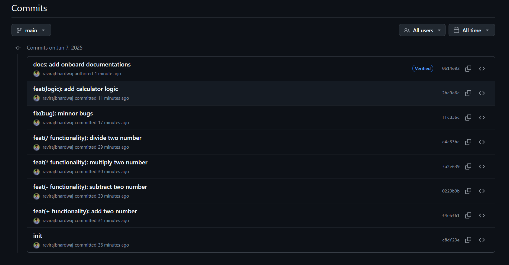
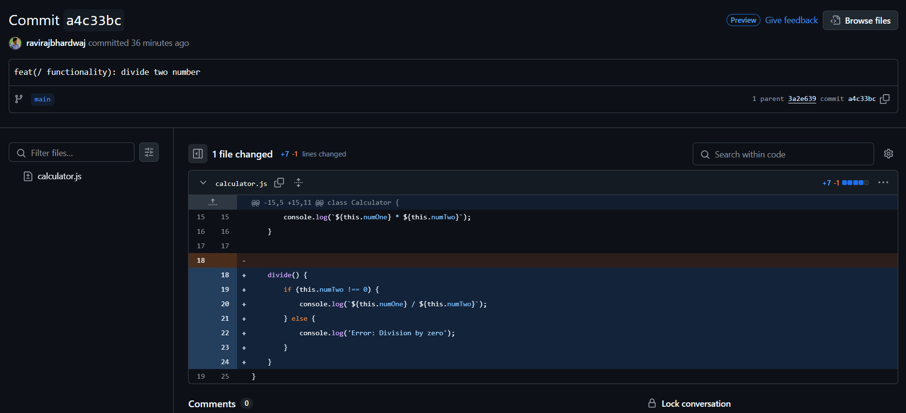

# 🛠️ Onboarding Documentation: Git and GitHub for ChaiCode Cohort

Welcome to the ChaiCode Cohort! This documentation is designed to introduce you to `Git` and `GitHub`, two essential tools for developers in our company. The purpose of this guide is to help you set up, understand, and use these tools effectively for seamless collaboration and code management. Together, we’ll ensure smooth workflows and strong teamwork. 🚀

---
 
## 1️⃣ Basics of Git and GitHub

### 🧑‍💻 What is `Git`?

Git is a **distributed version control system** that allows developers to:
- Track changes in their code.
- Collaborate with teammates.
- Maintain a complete history of the project.

It ensures every change is documented and reversible, making it indispensable for modern software development.

### 🤔 Why is `Git Used`?

- **Version Control**: Maintain a history of changes.
- **Collaboration**: Work with multiple team members on the same project without overwriting changes.
- **Code Safety**: Experiment with new features without affecting the main codebase.

### 🌐 What is `GitHub`?

GitHub is a **cloud-based platform** where you can store, share, and work together with others to write code:
- Centralized code repositories.
- Tools for code review, issue tracking, and continuous integration.

---
## 2️⃣ Installation and Setup

### Step 1: Install Git
1. Visit [Git Downloads](https://git-scm.com/downloads).
2. Download the version suitable for your OS (Windows, macOS, Linux).
3. Follow the installation instructions.

### Step 2: Configure Git
After installation, configure your name and email (must match your Chai Cohort email):
```bash
git config --global user.name "Your Name"
git config --global user.email "your.email@example.com"
```
To verify your configuration:
```bash
git config --list
```

### Step 3: Set Up GitHub

Create an account on [GitHub](https://github.com).

### SSH Key Setup (For Secure Access)
Generate an SSH key (if not already done):
       Follow prompts and save the key.
```bash
ssh-keygen -t rsa -b 4096 -C "your.email.com"
```

Copy the public key to GitHub:
      Go to GitHub Settings > SSH and GPG Keys > Add SSH Key and paste it.
```bash
cat ~/.ssh/id_rsa.pub
```
Authenticate GitHub via SSH
Test the SSH connection:
```bash
ssh -T git@github.com
```
---

## 3️⃣ Cloning the Repository
Copy the SSH/HTTPS URL and run:

```bash
git clone git@github.com:ravirajbhardwaj/Git-Github.git

cd Git-Github
```
---
## 4️⃣ Basic Git Commands

### Git Commands for GitHub

| **Command**                           | **Usage**                                                                 |
|---------------------------------------|---------------------------------------------------------------------------|
| `git init`                            | Initializes a new Git repository in your project folder.                 |
| `git clone <repository-url>`          | Clones an existing repository from GitHub to your local machine.         |
| `git status`                          | Displays the status of changes in your local repository.                 |
| `git add <file>`                      | Stages specific files for commit.                                        |
| `git add .`                           | Stages all changes in the current directory for commit.                  |
| `git commit -m "message"`             | Saves staged changes with a commit message.                              |
| `git branch`                          | Lists all branches in the repository.                                    |
| `git branch <branch-name>`            | Creates a new branch with the specified name.                            |
| `git checkout <branch-name>`          | Switches to the specified branch.                                        |
| `git merge <branch-name>`             | Merges the specified branch into the current branch.                     |
| `git pull`                            | Fetches and merges changes from the remote repository into your branch.  |
| `git push`                            | Pushes your commits to the remote repository.                            |
| `git remote add origin <url>`         | Links your local repository to a remote repository on GitHub.            |
| `git fetch`                           | Downloads changes from the remote repository without merging them.       |
| `git log`                             | Shows a log of commits in the repository.                                |
| `git diff`                            | Displays changes not yet staged or committed.                            |
| `git reset <file>`                    | Unstages a file that was staged with `git add`.                          |
| `git rm <file>`                       | Removes a file from the working directory and the staging area.          |
| `git push -u origin <branch-name>`    | Pushes the branch and sets it to track the remote branch.                |
| `git stash`                           | Temporarily stores changes not ready to be committed.                    |
| `git stash apply`                     | Reapplies the stored changes from the stash.                             |
| `git tag <tag-name>`                  | Creates a tag for the current commit (useful for versioning).            |
| `git show <tag-name>`                 | Displays information about a specific tag.                               |
| `git rebase <branch-name>`            | Moves or applies commits from one branch onto another.                   |
| `git cherry-pick <commit-hash>`       | Applies a specific commit from one branch to another.                    |
| `git revert <commit-hash>`            | Creates a new commit to undo the changes from a specific commit.         |


---

## 5️⃣ Commit Message Rules

### Why Good Commit Messages Matter?

- They provide a clear history of changes.
- Suggested Commit Message Guidelines:
  
- Help teammates understand the purpose of changes.
  
- Facilitate debugging and collaboration.

#### `Structure: <type>(<scope>): <description>`
Types: Use clear prefixes such as:
- `feat`: A new feature.
- `fix`: A bug fix.
- `docs`: Documentation changes.
- `style`: Code style or formatting changes.
- `refactor`: Code refactoring without changing functionality.

Examples:
```
feat(auth): add user login functionality

fix(api): resolve timeout issue in fetch requests
```

--- 

## 6️⃣ Best Practices

- **Pull Requests (PRs)**
  - Keep PRs focused on a single feature or fix.
  - Provide a detailed description of changes.
  - Assign reviewers and address feedback promptly.

- **Branching Workflow**
1. `Main Branch`: Always deployable and stable.
2.  `Feature Branches`: Develop new features or fixes (e.g., feature/login).
3. `Merge Strategy`: Merge feature branches into main via PRs.

### General Tips

- Commit often and meaningfully.
Regularly pull updates to stay in sync.
- Resolve conflicts as soon as they arise.

By following this documentation, you'll quickly get up to speed with Git and GitHub, ensuring productive and collaborative development at ChaiCode. Let's build amazing things together!

Learn More in-Depth : [Git and Github](https://app.eraser.io/workspace/dQOSFVn4yGW3YmVGLoCd?origin=share)
